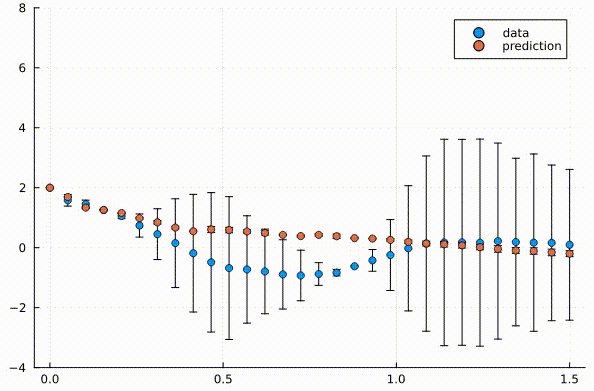

# NODEFit.jl

Fit time-series data with a Neural Differential Equation in Julia!

This repository contains time-series data fit capabilities using both Neural Ordinary Differential Equations and Neural Stochastic Differential Equations

Also checkout its Python [version](https://github.com/gpavanb1/NODEFit)

## How to install and execute?

Just instantiate the package and you can run the examples
```
julia fit_nsde.jl
```

The following program illustrates a basic example
```julia
using NODEFit
using Lux: Chain, Dense

#######
# Define the networks
#######
# Network dimensions
ndim, nhid = 2, 4
drift_net = Chain(x -> x .^ 3, Dense(ndim, nhid, tanh), Dense(nhid, ndim))
diff_net = Dense(ndim, ndim)

#######
# Define the data
#######
tsteps = collect(Float32, range(0.0f0, 1.0f0; length=30))
sde_data, sde_data_vars = # Matrices of time-series data and variances

#######
# Fit the data
#######
result_nsde = NODEFit.fit_nsde(drift_net, diff_net, tsteps, sde_data, sde_data_vars)

```

Full examples are provided in the [examples](./examples/) folder

## Sample Output



## Why use Julia?

Once compiled, Julia is much faster than Python and the following [article](https://gist.github.com/ChrisRackauckas/cc6ac746e2dfd285c28e0584a2bfd320) provides comparison for the underlying routines

Neural SDE fits for 500 iterations were performed on Early 2015 MacBook Pro in real-time (as seen in output) compared to ~10 seconds per iteration in NODEFit

## Whom to contact?

Please direct your queries to [gpavanb1](http://github.com/gpavanb1)
for any questions.

## Acknowledgements

This package would not be possible without the supporting [packages](./Manifest.toml). The assistance provided in Julia [Slack groups](https://julialang.org/slack/) is also gratefully acknowledged. Documentation of [DiffEqFlux.jl](https://diffeqflux.sciml.ai/) served as guidance for some of the routines.